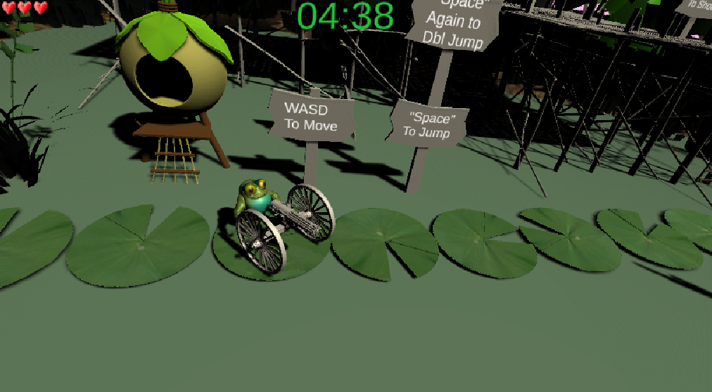
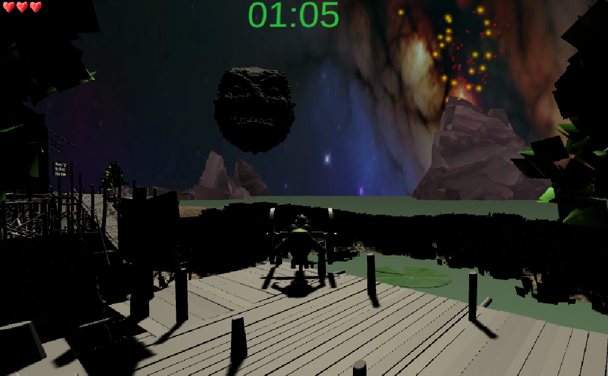
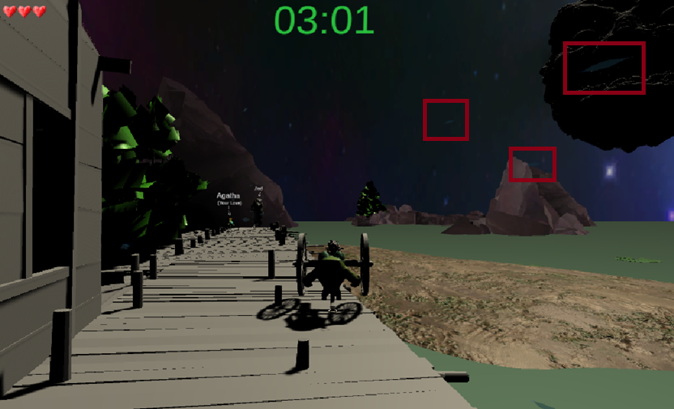

# Platformer - Prototype 1

## What were you experimenting with your prototype?

With this prototype I was experimenting with creating a platformer that could implement as many features from the "Platformer Notes" List as I could, as well as provide playtesters with a good "Game Feel". 

## What did you learn from your prototype?

From this prototype I learned how to implement into a platformer:

- Constant Jump Height
- Collecting Stuff
  -- Hidden Collectibles
  -- Enemy Drops Item
- Shooting
  -- Charged Attack
- Manual Camera Controls
  -- Moving the camera without moving the player in order to see more of the level
- Diagonal Platformers
- Time Limit
- Controlling Position in Air
- Double Jump
- Ground Pound
- Health
- Going Through Water Feeling Different
- Lives
- Swimming
- Climbing Ladders
- Wall Climbing / Sticking / Jumping
- Bosses
- I-frames
- Falling Platforms

In addition, I also learned how to:
- Create Intro Scenes and Ending Scenes
- Add 3D Game Models into Unity, as well as how to activate animations attached to Game Models from sketchfab.com

## Did you learn anything from your playtesters in class? What?

In class I learned from my playtesters that this prototype:

- Had a great "Game Feel" as I recieved a round of applause from playtesters, as well as a compliment from Playtester Nathan stating "This game could be used as an entry submission into a Masters Program (for Game Design)". 

-  The Proffesor -
  - Requested for the removal of "Tank Controlls" to increase Game Feel; As well as requested for Player Controls to be condenced into fewer buttons
  - Taught me how to "Scale with Screen Size" the Intro Scene Images I had in this prototype

## 5. Include an image of the game (example below)

## 6. Include a link to your game

# Platformer - Prototype 2

## What were you experimenting with your prototype?

With this prototype I was experimenting with removing Tank Controlls, condencing Player Controls into fewer buttons, as well as looked into other Game Features outside of my awareness that I could also implement, by watching my friends Live Stream the PC Surivial Game ["Valheim"](https://store.steampowered.com/app/892970/Valheim/).

While observing my friends play Valheim I observed two Game Features that immediatly stood out - Fog and "Visually Seen" Wind. Images of both shown below: 

I knew that both of these Game Features would not only increase Game Feel, but more importantly increase the perception of Simulated Space by being a form of Enviromental Polish.

 
 
 
 

## What did you learn from your prototype?

From my prototype I learned that creating "Fog" in Unity, is not very difficult at all to implement in a Game, and in fact can be done under a Minute by:
- Clicking on the "Window" Toolbar Option in Unity
- Click "Rendering"
- Click the "Lighting" Option
- Then you will be prompted with a New "Lighting" Window. You will then have to click the "Enviroment" Button.
- Scroll to where it says "Other Settings"
- Check the "Fog" Box

## Did you learn anything from your playtesters in class? What?

I was unfortunatly not present in class to have my game be playtested. 

## 5. Include an image of the game (example below)

## 6. Include a link to your game

