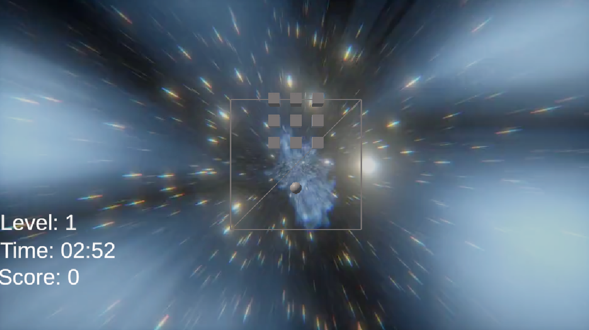
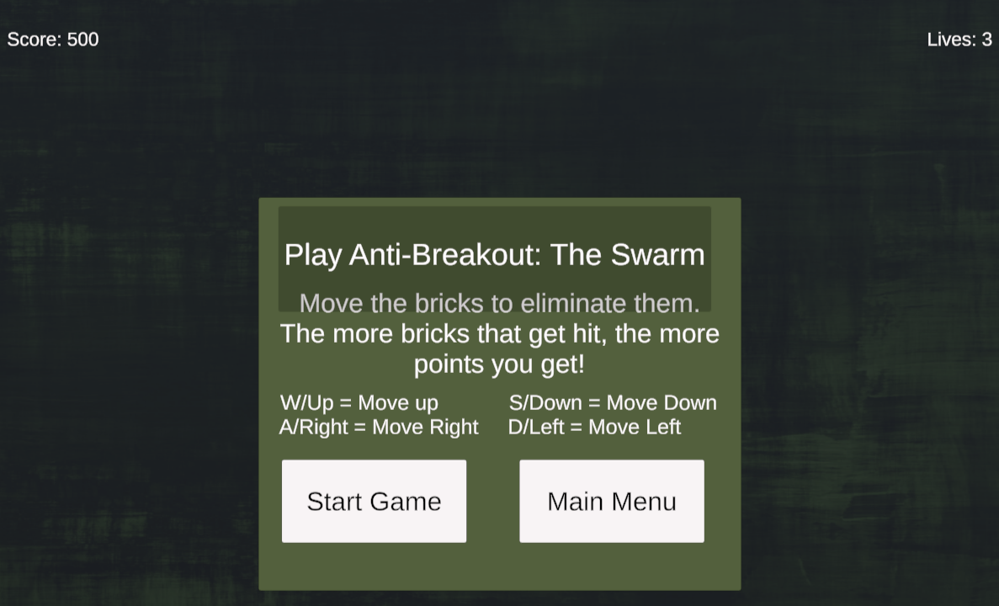
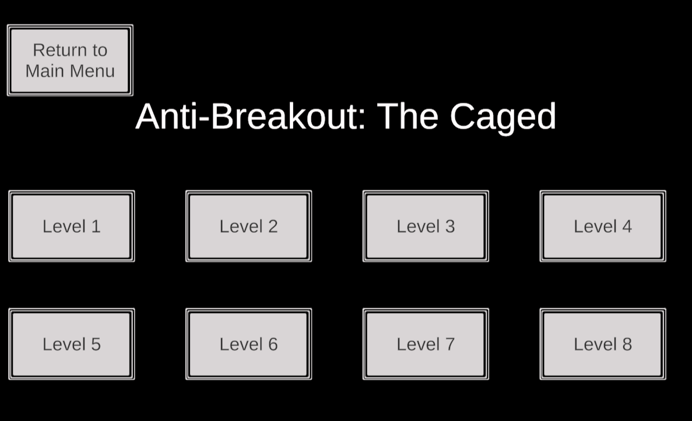
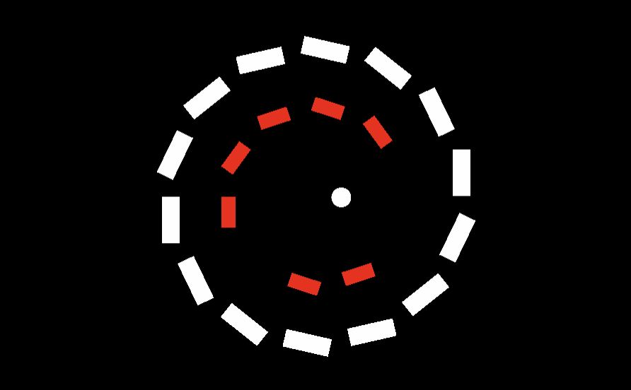
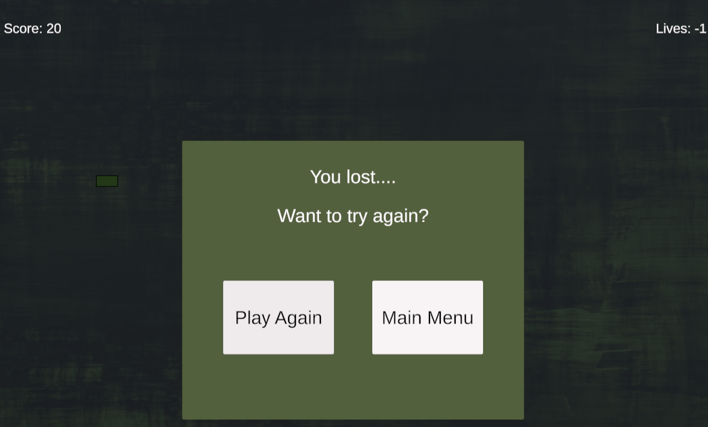

# Breakout 1

## What were you experimenting with your prototype?

With Prototype 1, I was experimenting with seeing if I could create a Breakout game that hit every element of Game Feel (Real-Time Control, Simulated Space, and Polish), that was also a rewarding challenge to create. After brainstorming on possible prototypes, I realized that the prototype I had in my mind that I felt great about designing, was a prototype where:

-The player could have a paddle that could move around the interior boundary of a wireframed sphere, creating 360 Degree Spherical Movement Controls

-3D bricks could be placed in the center of the sphere that would be destroyed upon collision with the ball bouncing of them, as well as the paddle

-The player would lose a life every time the ball hits the inner sphere boundary

-There would be a looping video of “space” playing in the background, for additional Polish and an attempt to add more Simulated Space Feel in the 3D Environment

-There would be an MP3 file that plays when the game starts, for additional Polish

All of these endeavors were also experimental challenges in themselves - as upon starting this course, I only made a few Unity Projects beforehand. Additional endeavors that I also strived to implement, but could not at due to lack of time were:

-Create a feeling of an Extension of Identity where the Sphere would display crack marks every time the ball hit it, as well as have a “cracking” mp3 sound be played upon ball collision.

-Instead of a looping video of “space” playing in the background, attempt to further Simulate Space by Polishing the 3D environment more, creating an array of star objects that would move outside of the Sphere, nested within another Sphere that would be a Skydome of space.

## What did you learn from your prototype?
From my prototype, having limited experience with Unity, I learned:

-Displaying a 3D object’s wireframe can be done in C# in Unity

-How to add a looping video into a Unity Game

-How to set up an MP3 file to play automatically into a Unity Game

## Did you learn anything from your playtesters in class? What?
From the playtesters in class, I learned that:

-The playtesters enjoyed the overall Game Feel, especially the elements of Polish added to the Game – Background video playing, background music playing, and sound effects when the ball hits the paddle.

-The playtesters had some difficulty getting use to the controls, as there was a Game Bug I could not solve in time before class. The Game Bug is identified when the playtesters moved the paddle directly to the top center of the Sphere, or directly to the bottom center of the Sphere, the Paddle’s directional vertical velocity would invert itself. That is - If the “W” key was held down by a playtester, moving the Paddle “Up”, to the top center of the Sphere, once the paddle was at / collided with the top center of the Sphere, the Paddle would then automatically reverse course, and start moving “Down”, switching the Paddle’s velocity, and vice verse if the Paddle reached the bottom center of the Sphere.

## 5. Include an image of the game (example below)
 

## 6. Include a link to your game

[https://arnoldtran.github.io/game-dev-spring2025/builds/breakout-2a](https://jtech555.github.io/game-dev-spring2025/builds/breakout-1)

   

# Breakout 2a - Anti-Breakout: The Swarm

## What were you experimenting with your prototype?

With Prototype 2a, myself and my group members (Nathan and Andrew), were experimenting to see if we could create an Anti-Breakout Game. That is, a game where the player would not control a Paddle, but instead, the Bricks/Blocks that are destroyed in Breakout. After brainstorming on how we could implement this concept idea, we began experimenting with this Prototype to see if we could:

-Create an array of prefab Bricks in a cluster, that the player could control as a Group, using the WASD keys.

-Create a Ball that will bounce around the sealed inner walls of a 2D environment. Every time the Ball collided with a Brick apart of the cluster, the player’s score would increase, creating positive Game Feel.

-Have the Brick cluster start with one brick, and once the Brick was destroyed, an “Upgrade” Menu would appear, allowing the user to purchase additional upgrades – “Brick Health” and “Additional Bricks”, creating a competitive incentive for the player to desire to achieve more powerups. Game level would then restart with upgrades added. 

## What did you learn from your prototype?
From this prototype I learned:
-Group members can use “Unity Version Control” when all group members are not together in person. This allows for one group member to sync their updates onto the cloud, which any other user can then download the latest updates from to continue work on the project.

-How to properlly organize code in an effective manner - Creating a Game Manager Script and UI Manager, instead of multiple C# files attached to different game objects.

## Did you learn anything from your playtesters in class? What?
Unfortunately, we did not learn anything from the playtesters in class. After syncing the latest updates to the Cloud via “Unity Version Control”, all group members were unable to load the game due to an error that was not present the previous night. My group, however, did take action when this was taken notice of during class, and tried to resolve the issue, but unfortunately we were unsuccessful.

## Include an image of the game (example below)
 

## Include a link to your game
Note: Click on Anti-Breakout: The Swarm
[Breakout 2a](https://arnoldtran.github.io/game-dev-spring2025/builds/breakout-2a)

   

# Breakout 2b: Anti-Breakout: The Caged

## What were you experimenting with your prototype?
- With Prototype 2b, myself and my group members (Nathan and Andrew), were experimenting to see if we could create another Anti-Breakout Game. That is, a game where the player would not control a Paddle, but instead, control the Bricks/Blocks that are destroyed in Breakout. After brainstorming on how we could implement this concept idea, we began experimenting with this Prototype to see if we could:
  
-Create separate circular rings of Bricks that the player could control, as a Ball bounced off the Bricks, starting from the center of the game. 

## What did you learn from your prototype?
From this prototype, my group members and I learned that:

-Having multiple Rings of Bricks in the game that the player could choose from, was a means of Polish that enhanced the player’s feeling of control in the prototype.

-There was a sense of an aesthetic sensation of control. As in the game “Frogger” where you control the character but it feels like game is controlling you. Although myself and my group members could control the Ring of Bricks in the game, it felt like the game was more so controlling us.

## Did you learn anything from your playtesters in class? What?
From the playtersters I learned that our group’s prototype created an exciting unique Game Feel. Not due to Polish, Simulated Space, or Real Time Control, but due to the game design being different in which the player controlled multiple Rings of Bricks, instead of a Paddle. 
In addition, I also learned that the playtesters:

-Felt that each Ring of Bricks should be highlighted when they are selected by the player, to help the player easily identify which Ring of Bricks they are controlling. This implementation would not only help improve real-time control, but also add additional Polish to the game. 

-Had mixed reviews on the game controls. One playtester liked the game controls, and another playtester did not like the game controls – believing that the 2 keys for rotating the Rings should be on one side of the keyboard, and the 2 keys for selecting the different rings should be on the other side of the keyboard. Both players liking two different forms of game interaction in regard to game input controls.

## Include an image of the game (example below)
 

## Include a link to your game
Note: Click on Anti-Breakout: The Caged 
[Breakout 2b](http://arnoldtran.github.io/game-dev-spring2025/builds/breakout-2b)

   

# Prototype 3 - Anti-Breakout The Swarm

## What were you experimenting with your prototype?
With Prototype 3 my group members and I were experimenting with creating a cluster of bricks that the user could control, to hit the ball on screen. For every brick that was hit by the ball in game, the player would recieve a point increase, that the player could then exchange to buy upgrades with.

## What did you learn from your prototype?
From this prototype I learned how to create a canvas for upgrades in unity, as well as how to create an array of bricks that a player could control to move around - splicing bricks that were hit by the in game ball upon collision. 

## Did you learn anything from your playtesters in class? What?
Unfortunatly, our group did not have a working model for our playtesters with the upgrades, due to expierncing Unity Version Control Errors. 

## Include an image of the game (example below)
 

## Include a link to your game
Note: Click on Prototypes, then Anti-Breakout: The Caged 
[Breakout 4](http://arnoldtran.github.io/game-dev-spring2025/builds/breakout-2b)

   

# Prototype 4 - Anti-Breakout The Caged

## What were you experimenting with your prototype?
-With Breakout 2a my group members and myself were experimenting with taking the playtesters feedback to improve the Game Feel, by creating a Ring Selector and adding additional levels to our game. 

## What did you learn from your prototype?
-From this prototype my group members and I learned that the implementation of levels was not an easy feat to accomplish. Managing time to accomplish this goal, took away from further improving additional aspects of the game, such as Polish additions to the game that could have been made. Additionally my group members and I also learned how to create levels, as well as learn more in relation to programming keyboard input controls. 

## Did you learn anything from your playtesters in class? What?
-From the playtesters in class, I learned that playtesters enjoyed now having a Ring Selector in the prototype, however, playtesters were still not completly satisified with the controls we had set to rotate the Rings, and selecte between different ones. 

## Include an image of the game (example below)
 

## Include a link to your game
Note: Click on Prototypes, then Anti-Breakout: The Swarm 
[Breakout 4](http://arnoldtran.github.io/game-dev-spring2025/builds/breakout-2b)

