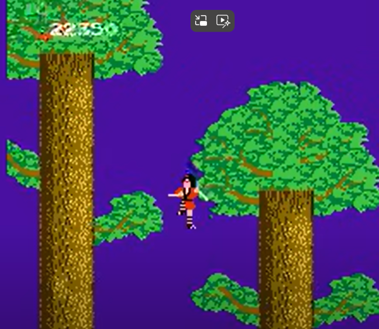

# Platformer 1 – Contra – SNES – 1987

## Describe the movement on the ground (pay attention to the details)
-The player’s character, Lance, has 4 different unique sprite actions the player can activate when Lance is on the ground. These sprite actions are: Standing, Laying Down, Walking, and Jumping (Source: Contra - Nintendo NES - Sprites). Breaking down the sprites individually it appears that:

Standing Sprite – Is a single frame sprite, showing Lance aiming his rifle at a 90 degree angle, straight in front of Lance, towards the direction that Lance is facing. 

Laying Down – Is a single frame sprite, allowing for the player to dodge enemy bullets fired at the player's torso. In addition allows the plyer to fire a bullets at the enemy’s shins.

Walking – Appears to be a 3 framed sprite, showing the player Lance carrying his rifle at a 45 degree angle into the air, as well as shows Lance’s legs motioning to appear as if Lance is walking.

## Describe the jump (again, be detail oriented)
- When the player’s character Lance jumps in the game, Lance performs a verticle jump - curling his body into a small ball up into the air, coming back down. This can be best exhibited via Lance's Jumping Sprite taken from https://nesmaps.com/maps/Contra/sprites/ContraSprites.html, seen below:
 

  

This action is a great form of Polish in the game because it creates for the player a fun detailed physical simulation of movement, as well as sells the player a sense of realism to the game. 
The jump also gives a cue that the player – the Hero- in the game, Lance, is "agile and quick", for being a ~250lb muscular man. This could symbolize that “Heros” are light and fast, allowing children to adapt to a sense of a shared positive reinforcing identity, increasing Game Feel - “I (a child) am quick and fast, the player is quick and fast, and is a Hero. I feel like I am Hero, I can relate.” 

## How has the game’s level design been influenced by these movement and jump mechanics?
-The game’s level design has been influenced by these movement and jump mechanics in a variety of different ways:
https://youtu.be/2mWZlNOzdv8?t=202 – In “Stage 3 – Waterfall” – We can see that this level has multiple platforms and enemies above the player. This level design allows for the player to learn to use their jump and shooting mechanic at the same time, to fire in multiple directions, allowing them to take out a wider range of enemies in the level.
https://youtu.be/2mWZlNOzdv8 - In “Stage 8 – Alien’s Lair” – We can see that this level has enemies at the bottom right corner of the screen. Since the player can position themselves on the platform in a Laid Down Position, this level influences the player to utilize the Laid Down Position, so their weapon will have more accuracy in taking out the bottom right corner enemies. 

## Include a screenshot of the game
 

# Platformer 2 – Donkey Kong Country - SNES – 1994
## Describe the movement on the ground (pay attention to the details)
-The movement on the ground for the character Donkey Kong, in Donkey Kong Country, is very fluid and completely polished for its time period in relation to other SNES platformer games. The movement for Donkey Kong provides the user with a more “organic” feeling, than a “mechanical” feeling.

For example:

The character Donkey Kong "emotes" when Donkey Kong is stationary or has stopped moving by the player. As can be seen from the .gif file below taken from https://bit-boy.tumblr.com/post/125391297023/segagenesisevangelion-donkey-kong-country.

 

The stationary emoting allows the player to relate more to the character, creating a stronger sense of realism. As appose to the character Lance in Contra, who does not emote at all when stationary.

Additionally there are many frames used for the sprites of Donkey Kong, that can be seen below in Donkey Kong's Sprite Sheet, taken from https://www.spriters-resource.com/fullview/45659/.

 

This Sprite Sheet not only exhibits a great amount of polish into making Donkey Kong appear to be more “real”, but also shows the amount of work gone into creating a non-mechanical feeling towards the character. 

##Describe the jump (again, be detail oriented)
When the player’s character (Donkey Kong) jumps, Donkey Kong can be seen leaping, raising his arms above his head, and extending his leg’s out, then colliding with the ground on his feet first, followed by his hands. A frame by frame of Donkey Kong’s jumping sprite animation can be seen below:
 

 
This jump animation not only is very polished in detail but also appears to mimic the same animation as a Gorilla in real life does. For example, in the first few seconds in this video clip of a Gorilla jumping at Twycross Zoo, we can observe that the Gorilla exhibits the same jump motion:
https://youtu.be/QPGbzML3_8s?t=149

## How has the game’s level design been influenced by these movement and jump mechanics?

The game’s level design has been influenced by these movement and jump mechanics, in a variety of different ways.
-By allowing Donkey Kong to land on his feet first, when colliding with the ground, the level design has been influenced to create game objects that must be jumped on to be activated. For example, in the image below a box with a rhinosoarus can be seen. In order for Donkey Kong to open this box, Donkey Kong has to jump on it, with his feet first, then a Rhino to appear, then Donkey Kong will have to jump on the Rhino again to mount it. 

 

## Include a screenshot of the game
 

 

# Platformer 3 – The Legend of Kage – NES – 1986 (American Version)
## Describe the movement on the ground (pay attention to the details)

-On the ground, the player’s (Kage's) movement in The Legend of Kage appears to be mechanical – that is a cycle between 2 frames where: 
Frame 1 - Kage has a right arm extended outward, and both legs straight when running
Frame 2 - Kage has their right arm now at the character’s side, and leg is now shown to be bent forward. Both frames cycling one after another to make Kage appear as if running (https://youtu.be/n6c_AX5kAfY). 

## Describe the jump (again, be detail oriented)
Kage's jump in The Legend of Kage, is very unique compared to other platformer games I have personally played. In The Legend of Kage, Kage has the ability to jump in the game, from one side to another, at great heights and lengths as can be seen below:

 

This jump ability allows Kage to jump over trees and onto tree branches to attack enemies, at a maximum height of about 13x Kage's height, and a maximum length about 50x the width of Kage. 
In addition to Kage’s jump, the player can also control Kage to jump vertically (https://youtu.be/n6c_AX5kAfY?t=263). When this jump is performed, the player’s character also swings their weapon – a blade - in their hand. 

## How has the game’s level design been influenced by these movement and jump mechanics?
The game’s level design has been influenced by Kage's movement and jump mechanics by requiring the levels to be large in size. Since Kage has the ability to jump at large heights and distances, a small, confined level would not be ideal for the player’s character, because that would decrease the Game Feel, not allowing the player to utilize Kage’s ability fully. In addition, the level design has also been influenced by Kage's movement and jump mechanics by requiring for the levels to have enemies in positions at high altitiudes - on tree branches -, to attack the player when Kage leaps long distances. 

## Include a screenshot of the game
  

